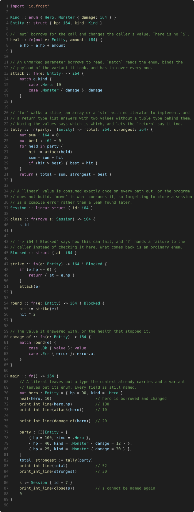

<p align="center">
  <a href="https://github.com/matthewjberger/frost"></a>
  
</p>

# Frost

**A data-oriented systems language that is memory-safe with no garbage collector and no lifetimes, and compiles itself.**

A Frost program is plain data and free functions that transform it. There are no classes and nothing is allocated behind your back. It compiles to native code through Cranelift or to portable C, and the compiler is written in Frost.

## Borrows are parameter modes

A borrow is what a parameter mode means, so there is no reference type to write and no lifetime to describe.

```frost
wound :: fn(mut e: Entity, amount: i64) { e.hp = e.hp - amount }
```

`mut` borrows for the call and mutates in place. An unmarked parameter borrows to read. `move` takes ownership. There is no `&` anywhere in the language, so a borrow has nothing to be stored in and nowhere to escape to. That one rule is why Frost needs no lifetime annotations, and the rest of the design grows from it.

| in place of | Frost has |
| --- | --- |
| lifetimes on references | borrows that are parameter modes and cannot escape |
| a garbage collector | arenas and pools you can see |
| a long-lived pointer into a collection | a generational handle, a copy value that goes stale rather than dangling |
| destructors | linear resources, consumed exactly once, checked at compile time |
| exceptions and `Result` plumbing | failure sets, `-> T ! E` and `?` |
| dynamic dispatch | monomorphized generics, so the inner-loop call is direct |
| classes and methods | plain structs and free functions |

## A short tour

The tour covers borrows that are parameter modes, a resource the compiler counts,
a failure that travels in the signature, a `for` that needs no iterator, a
function that answers with two values, and literals that leave out a type the
context already carries while every field keeps its name.

<p align="center">
  
</p>

```bash
frost examples/tour.frost          # compile, link, and run
```

That is [`examples/tour.frost`](examples/tour.frost). A test compiles it, checks
what it prints, and checks it still matches what is written here.

For long-lived data, a value lives in a pool and is named by a `Handle`, a small copy value. Freeing a slot raises its generation, so a handle to a reused slot reads as stale rather than reading whatever took its place. The archetype entity-component system in [`std/ecs.frost`](std/ecs.frost) is built on that, and [`just scene`](docs/book/src/std/ecs.md) runs it: entities in an ECS, two passes, depth deciding what is in front.

## Documentation

The documentation is a book, in [`docs/book`](docs/book).

```bash
cargo install mdbook
cd docs/book && just serve
```

[A tour of Frost](docs/book/src/tour.md) is the language by example and the
place to start. [Coming from Rust](docs/book/src/coming-from-rust.md) is the
same ground for someone who already thinks in ownership and borrows.
[Patterns](docs/book/src/patterns.md) is what to write instead, once the syntax
is familiar. The [language reference](docs/book/src/reference/conformance.md) is
normative, and [the roadmap](docs/book/src/roadmap.md) is what is left.

## What it does

The language has structs and tagged enums, `match` with payload and tuple patterns that has to cover every variant or say what the rest do, and generics that monomorphize over types, values, and functions, so a call in an inner loop stays direct rather than going through a pointer. A `for` walks a range or a sequence as the index-and-bound loop it stands for, a function answers with several values through a return type list rather than a tuple type, and a literal leaves out a type the context already carries, while every field keeps its name because the name is what says where the value lands. A resource that must be released is marked `linear` and the compiler counts it, consumed once on every path out or the program does not build. Long-lived data lives in pools addressed by generational handles, a region check keeps a pointer from outliving the block or the stack frame it points into, and a value constant can be a folded integer expression. There are no visibility modifiers and no methods.

It calls C without a binding layer. An `extern fn` links against a C library with the natural ABI, including one that returns a struct by value and one that takes a Frost function as a callback with a typed context.

One typed intermediate representation feeds three backends, a Cranelift native path, a portable C path, and a small interpreter. A differential test runs every program through all three and checks the answers match, so a lowering bug shows up as a disagreement rather than as a wrong binary.

The compiler is written in Frost. `selfhosted/frost.frost` reproduces itself byte for byte through its own C backend and its own x86-64 assembly backend, so a build can go from source to a running compiler with no C compiler in the loop. A full native build of 58k lines runs at about 166,000 lines per second with code generation spread across cores, and `--incremental` rebuilds only the modules an edit can reach.

The standard library is ordinary Frost. It has length-carrying strings, a growable `Vec` and a hash map, file and formatted output, a sort, the slab and structure-of-arrays `columns` containers, an archetype entity-component system, and vector, matrix, and quaternion math at both single and double precision. See [`std/`](std), [docs/book/src/std/ecs.md](docs/book/src/std/ecs.md) and [docs/book/src/std/math.md](docs/book/src/std/math.md).

## Getting started

```bash
cargo build --release          # build the compiler

frost program.frost                              # compile, link, and run
frost --link -o program program.frost            # link to a named executable
frost --native -o program.o program.frost        # object file only
frost --emit-c -o program.c program.frost        # portable C instead of Cranelift
frost --run-ir program.frost                     # interpret the typed IR
frost --test program.frost                       # run the file's `test` blocks

frost --link --incremental -o program program.frost   # rebuild only what changed
frost --link --freestanding -o program program.frost  # link no C standard library
frost --link -L vendor -o program program.frost       # add an import search path
```

Requires a Rust toolchain and a C compiler (gcc or clang) for linking. An import is looked for beside the importing file, then on `-L` and `FROST_PATH`, then in the project's `frost.json`, then in the bundled [`std/`](std).

### The graphics demos

Six programs that open a window and draw through wgpu, in the order they were
built, each one the smallest step past the last:

```bash
just deps        # fetch SDL3 and wgpu-native, once

just window      # a window that opens, resizes, and closes
just triangle    # the first thing drawn: one triangle, one pipeline
just scene       # entities in an ECS, two passes, depth deciding what is in front
just spinning    # lit surfaces: a mesh cache, a material registry, two bind groups
just textured    # the same field with its surfaces read off an image
just shadowed    # compute, shadows, a bloom chain, and a second view in a corner
```

From `scene` on, what runs and in what order is a render graph
([`examples/graphics/graph.frost`](examples/graphics/graph.frost)). A pass
declares the targets it reads and writes; the graph works out the order from
those declarations, makes every target the window does not own, and decides each
load op. `shadowed` is what that buys: five passes written in whatever order reads
well, ordered by the resources between them, with the three targets in the
middle sharing textures because the graph knows when each is last read.

`W`/`A`/`S`/`D` move, `Q` and `E` drop and rise, the arrow keys look, and escape
closes. Resizing works in all of them. `just input` opens a window and reports
what the platform layer saw, which is what to run when a key is not doing what
it should.

`just deps` puts SDL3 and wgpu-native beside the examples. It is the only step
that reaches the network, and it is needed once. Set `SDL3_DIR` to use an SDL
already on the machine instead.

The bindings in [`examples/graphics/wgpu.frost`](examples/graphics) are generated
from `webgpu.json` rather than written, which is why there are three thousand
lines of them and no hand-maintained header.

### Editor support

```bash
just install-editor    # link the VS Code extension, then reload the window
```

A `.frost` file gets syntax highlighting, snippets for the declaration forms, and validation for `frost.json`. A fenced block tagged `frost` in a markdown file is highlighted the same way. `Ctrl+Shift+B` runs every compiler check over the open file and puts what it finds in the Problems panel, on the line that caused it.

The extension is in [`.vscode/frost`](.vscode) rather than on the marketplace, so it is linked rather than installed. `just editor-dir` prints where this VS Code reads its extensions, which is not `~/.vscode/extensions` when VS Code is a portable install. The grammar's keywords and builtins are held to the compiler's own lists by a test, so the two cannot drift apart.

## Status

Everything above works today and is checked by the test suite on every commit, including both self-hosting fixpoints and the three-backend differential run. The compiler has compiled itself.

The two compilers accept the same language. They are held to it by running the same programs through both and comparing what each accepts, and every form the language has is a test that both of them compile.

## Project layout

```
frost/
├── selfhosted/   # the Frost compiler, written in Frost
├── src/          # the bootstrap compiler, in Rust: builds stage 0, and is the oracle
├── std/          # the standard library, in Frost
├── runtime/      # a small C runtime (bounds check, assert, IO helpers)
├── examples/     # runnable programs
├── bench/        # the benchmark generator
├── .vscode/      # editor settings, and the VS Code grammar for .frost
└── docs/book/   # the documentation, as an mdBook
```

## Tests

```bash
cargo test              # everything, including both self-hosting fixpoints
just test-interfaces    # the whole suite again, built from module interfaces
just bench-scaling      # how the pipeline scales
just bench-incremental  # what --incremental saves
```

## Contributing

External contributions are not being accepted yet. The language surface is still settling. Guidelines will land here once it stops moving.

## License

Dual-licensed under either of:

- MIT License ([LICENSE-MIT](LICENSE-MIT) or http://opensource.org/licenses/MIT)
- Apache License, Version 2.0 ([LICENSE-APACHE](LICENSE-APACHE) or http://www.apache.org/licenses/LICENSE-2.0)

at your option.

Unless you explicitly state otherwise, any contribution intentionally submitted for inclusion in `frost` by you, as defined in the Apache-2.0 license, shall be dual licensed as above, without any additional terms or conditions.
